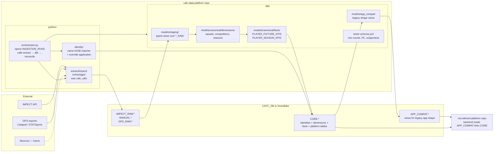

# Plan: Stand up `cafc-data-platform` and clean up `CAFC_DB`

## Context

The recruitment platform (FastAPI + React, this repo) is a runtime application. The work to build the canonical layer in `CAFC_DB` — raw landing zones, identity resolution, KPI fact tables, `APP_COMPAT` views — is a data pipeline with a completely different lifecycle, different Snowflake permissions, and different reviewers. It should not live in the recruitment-platform repo. Your existing `cafc_utils` (currently at `~/Desktop/CAFC/cafc_utils`) is already this kind of code living outside the platform; this plan turns that pattern into a proper home.

This plan creates a new repo at `/Users/hashim.umarji/Projects/cafc-data-platform`, vendors `cafc_utils` into it, layers a dbt project on top for the SQL-shaped work, keeps Python for the parts dbt is bad at (API extraction, identity matching), and gives you a safe, scripted way to clean up the half-built state in `CAFC_DB` along the way.

The recruitment-platform repo gets a separate, much smaller change later: add three env vars, point unqualified table refs at `{PLATFORM_DB_SCHEMA}.x`, cut over feature areas one PR at a time. That's a follow-on plan, not this one.

---

## Why two repos, not one

| | recruitment-platform | cafc-data-platform |
| --- | --- | --- |
| Deploys when | product features ship | canonical schema or pipeline changes |
| Snowflake role | `APP_ROLE` (SELECT/INSERT/UPDATE on its tables) | `SYSADMIN`-ish (CREATE/ALTER schemas, tables, views) |
| Reviewers | full-stack engineers | data/analytics engineers |
| CI runs | `npm test`, `pytest`, lint | `dbt build`, `dbt test`, Snowflake connectivity check |
| Reads from | `CAFC_DB.APP_COMPAT` then `CAFC_DB.CORE` | `CAFC_DB.*_RAW` |
| Writes to | platform tables in `CORE` | every table in `CORE` |

The seam is the Snowflake schema, not a Python import.

---

## Cost posture — zero additional software billing

The entire stack uses tools with no license cost beyond the Snowflake compute you already pay for.

| Need | Tool | License cost |
| --- | --- | --- |
| Raw ingest from IMPECT API (pull) | Python (`cafc_utils`) | $0 |
| Raw ingest from file-drop providers (future GPS) | Snowflake Task + `COPY INTO` from external stage | $0 (no Snowpipe — Snowpipe has per-file serverless billing on top of compute) |
| Identity resolution | Python | $0 |
| All SQL transforms (staging → canonical → `APP_COMPAT`) | **dbt Core** (MIT, open source) | $0 — **not** dbt Cloud, which is paid |
| Orchestration | Snowflake Tasks + GitHub Actions (free tier: 2,000 min/month for private repos) | $0 |
| Schema docs / lineage | `dbt docs` (static HTML, optional GitHub Pages) | $0 |
| Safety snapshots | Snowflake zero-copy clones | $0 until data diverges |

Only recurring spend is Snowflake compute, which is unchanged from today. Anything we'd otherwise reach for that costs money (dbt Cloud, Fivetran/Stitch/Airbyte Cloud, Snowpipe, Dagster+/Astronomer, Cortex Analyst per-message billing) is explicitly excluded.

---

## Pipeline shape



The split inside `cafc-data-platform`:

- **Python** owns anything dbt is bad at: HTTP/retry/pagination for raw extracts, identity resolution (mint new `CAFC_PLAYER_ID`s, apply override rows, write to a `PLAYER_IDENTITY_CANDIDATES` queue when uncertain), and the `INGESTION_RUNS` transaction envelope.
- **dbt** owns everything that's a SQL transform: staging views, canonical dimensions, KPI facts, `APP_COMPAT` views, plus all the schema/data tests that catch regressions without bespoke reconciliation code.

---

## Part 1 — Clean up `CAFC_DB` (do this first, separately)

Run these from a Snowflake worksheet (or a one-off Python script in `cafc_utils`), **before** any new development. Each step is independent and reversible until you drop.

### Step 1.1 — Take a safety snapshot (free, instant)

Snowflake zero-copy clones are free until divergence. Take one of the whole database so any later drop is undoable.

```sql
CREATE DATABASE CAFC_DB_SNAPSHOT_20260523 CLONE CAFC_DB;
CREATE DATABASE RECRUITMENT_TEST_SNAPSHOT_20260523 CLONE RECRUITMENT_TEST;
```

Keep both for 90 days minimum. They cost nothing unless data diverges.

### Step 1.2 — Inventory what's actually there

```sql
-- Every schema and table count
SELECT TABLE_SCHEMA, TABLE_NAME, ROW_COUNT, BYTES, LAST_ALTERED
FROM CAFC_DB.INFORMATION_SCHEMA.TABLES
ORDER BY TABLE_SCHEMA, TABLE_NAME;

-- Anything labelled _TEST, _DEBUG, _OLD, _BACKUP — candidates to drop
SELECT TABLE_SCHEMA, TABLE_NAME, ROW_COUNT
FROM CAFC_DB.INFORMATION_SCHEMA.TABLES
WHERE TABLE_NAME ILIKE '%TEST%'
   OR TABLE_NAME ILIKE '%DEBUG%'
   OR TABLE_NAME ILIKE '%OLD%'
   OR TABLE_NAME ILIKE '%BACKUP%';

-- Who reads from RECRUITMENT_TEST.PUBLIC vs CAFC_DB.*
SELECT
  REGEXP_SUBSTR(QUERY_TEXT, '(RECRUITMENT_TEST|CAFC_DB)\\.\\w+\\.\\w+', 1, 1, 'i') AS TABLE_REF,
  COUNT(*) AS QUERIES
FROM SNOWFLAKE.ACCOUNT_USAGE.QUERY_HISTORY
WHERE START_TIME > DATEADD(DAY, -7, CURRENT_TIMESTAMP())
  AND QUERY_TEXT ILIKE ANY ('%RECRUITMENT_TEST%', '%CAFC_DB%')
GROUP BY 1
ORDER BY 2 DESC;
```

Save the output. It's your "before" picture and your retire-list.

### Step 1.3 — Promote `SCOUT_REPORTS_TEST` to production shape

`CORE.SCOUT_REPORTS_TEST` (7,734 rows) is half-migrated and `CORE.SCOUT_REPORTS_PLAYER_MIGRATION_DEBUG` is scratch. Resolve both:

```sql
-- 1. Confirm row count matches expected
SELECT COUNT(*) FROM CAFC_DB.CORE.SCOUT_REPORTS_TEST;  -- expect 7,734

-- 2. Rename _TEST → production name (atomic in Snowflake)
ALTER TABLE CAFC_DB.CORE.SCOUT_REPORTS_TEST RENAME TO CAFC_DB.CORE.SCOUT_REPORTS;

-- 3. Drop the debug table (snapshot has it if needed)
DROP TABLE CAFC_DB.CORE.SCOUT_REPORTS_PLAYER_MIGRATION_DEBUG;
```

The dbt project will manage this table going forward as a model, but the rename now means there's only one "scout reports" object in `CORE` from this moment on.

### Step 1.4 — Decide the fate of `MIGRATION.*`

`MIGRATION.PLAYER_ID_MAP` / `FIXTURE_ID_MAP` are one-shot translation tables built to do the original legacy → canonical rebind. After Phase 5 of the platform cutover they have no runtime callers — they're just history. Two options:

- **Keep** as historical reference, but mark read-only: `GRANT USAGE ON SCHEMA MIGRATION TO ROLE READ_ONLY_ROLE; REVOKE INSERT, UPDATE, DELETE ON ALL TABLES IN SCHEMA MIGRATION FROM PUBLIC;`
- **Rename** to `LEGACY_MIGRATION` to make the historical intent obvious in `INFORMATION_SCHEMA`.

`SCOUT_REPORT_PLAYER_ID_OVERRIDES` and `SQUAD_NAME_CORRECTIONS` are different — they're operational overrides that the new identity matcher needs to consult on every refresh. Move those into `CORE.IDENTITY_OVERRIDES` (single generic shape: `SOURCE_SYSTEM, EXTERNAL_ID, CAFC_PLAYER_ID, REASON, CREATED_BY, CREATED_AT`). Migrate the 6 + 28 existing rows once; new overrides land in the new table.

### Step 1.5 — Leave `RECRUITMENT_TEST.PUBLIC` alone for now

It stays untouched until the recruitment-platform cutover completes (separate plan, weeks 2–5). After 30 days of zero reads in `QUERY_HISTORY`, rename to `RECRUITMENT_TEST.LEGACY` and revoke writes; drop after another 30 days.

---

## Part 2 — Stand up `cafc-data-platform`

### Step 2.1 — Create the repo

Locally:

```bash
cd ~/Projects
mkdir cafc-data-platform && cd cafc-data-platform
git init
gh repo create cafc-data-platform --private --source=. --remote=origin
```

### Step 2.2 — Vendor `cafc_utils` in

```bash
# from ~/Projects/cafc-data-platform
git mv ~/Desktop/CAFC/cafc_utils python/extract/impect
git commit -m "vendor cafc_utils as python/extract/impect"
```

(Or copy + delete if `cafc_utils` is its own git repo and you want a clean history; in that case archive the old repo with a README pointing at the new home.)

### Step 2.3 — Layout

```
cafc-data-platform/
├── README.md                            # how to run a refresh end-to-end
├── pyproject.toml                       # ruff + uv/poetry; pins snowflake-connector-python, dbt-snowflake
├── .github/workflows/
│   ├── pr.yml                           # dbt parse + lint + test against staging schema
│   └── nightly.yml                      # full prod refresh trigger (or hand off to Snowflake Tasks)
├── python/
│   ├── extract/
│   │   ├── impect/                      # was cafc_utils — IMPECT API → IMPECT_RAW.*
│   │   │   ├── client.py
│   │   │   ├── snowflake_loader.py
│   │   │   └── ...
│   │   ├── manual/                      # CSV / sheets → MANUAL.*
│   │   └── gps/                         # ONLY if vendor exposes an API; for S3 file
│   │                                    # drops use snowflake/tasks/ instead
│   ├── identity/
│   │   ├── matcher.py                   # normalised commonname + DOB; reads CORE.IDENTITY_OVERRIDES
│   │   ├── mint.py                      # idempotent CAFC_PLAYER_ID minting via Snowflake sequence
│   │   ├── candidates.py                # writes to CORE.PLAYER_IDENTITY_CANDIDATES on ambiguity
│   │   └── merge.py                     # explicit merge_player(loser, winner) operation
│   ├── orchestrator.py                  # opens INGESTION_RUNS → extract → identity → dbt build → reconcile
│   └── _snowflake.py                    # connection helper; reads SNOWFLAKE_* env vars
├── dbt/
│   ├── dbt_project.yml
│   ├── profiles.yml.example
│   ├── models/
│   │   ├── staging/
│   │   │   └── impect/                  # stg_impect__players.sql etc. typed views over IMPECT_RAW
│   │   ├── canonical/
│   │   │   ├── dimensions/              # core_squads.sql, core_competitions.sql, etc.
│   │   │   └── facts/                   # core_player_fixture_kpis.sql, core_player_season_kpis.sql
│   │   └── app_compat/                  # one view per legacy table, emits DATA_SOURCE + dual IDs
│   ├── seeds/
│   │   ├── kpi_definitions.csv          # one row per metric, provider-agnostic
│   │   └── load_metric_definitions.csv
│   ├── snapshots/                       # for slowly-changing dimensions if needed
│   └── tests/
│       ├── schema.yml                   # not_null, unique, relationships
│       └── singular/
│           ├── row_count_parity.sql
│           └── no_orphan_kpis.sql
└── snowflake/
    ├── ddl/                             # idempotent CREATE SCHEMA / GRANT scripts
    │   ├── 20260523_create_schemas.sql
    │   ├── 20260523_grants.sql
    │   └── 20260523_identity_overrides.sql
    └── tasks/                           # scheduled jobs and file-drop ingest
        └── gps_<vendor>.sql             # future: CREATE TASK … AS COPY INTO
                                         # GPS_RAW.<vendor>_SESSIONS FROM @s3_stage
```

### Step 2.4 — Snowflake DDL the repo owns

These are the things dbt won't create (schemas, roles, grants, sequences, the candidates/overrides operational tables).

- `snowflake/ddl/20260523_create_schemas.sql` — `CREATE SCHEMA IF NOT EXISTS CAFC_DB.GPS_RAW`, future provider raw schemas.
- `snowflake/ddl/20260523_grants.sql` — `DATA_PLATFORM_ROLE` (writes to everything in `CAFC_DB` except the platform tables in `CORE` that the app owns), `APP_ROLE` (reads `APP_COMPAT` and `CORE`; writes only platform tables).
- `snowflake/ddl/20260523_identity_overrides.sql` — `CORE.IDENTITY_OVERRIDES`, `CORE.PLAYER_IDENTITY_CANDIDATES`, `CORE.INGESTION_RUNS`. Plus a one-shot insert that migrates the 6 + 28 rows out of `MIGRATION.*` into the new override table.

All DDL is `CREATE … IF NOT EXISTS` and re-runnable.

### Step 2.5 — Initial dbt project

```bash
cd dbt/
dbt init                                  # answers: snowflake, account, role, warehouse, CAFC_DB, dev schema
```

Wire `dbt_project.yml` so:
- `models/staging/+materialized: view` (cheap, always-fresh views over raw).
- `models/canonical/dimensions/+materialized: table` (small, full refresh nightly).
- `models/canonical/facts/+materialized: incremental` with `unique_key: ['cafc_player_id','cafc_fixture_id','cafc_kpi_id']` and `on_schema_change: append_new_columns` (UPSERT semantics; only new rows + late-arriving updates touched).
- `models/app_compat/+materialized: view` (zero-cost, always current).

Sources declared in `models/staging/impect/_sources.yml` point at `IMPECT_RAW.*` with freshness checks (warn after 24h, error after 48h).

### Step 2.6 — Identity loader (Python, the careful bit)

`python/identity/matcher.py`:
- Pull all new `(SOURCE_SYSTEM, EXTERNAL_ID)` pairs from a staging model that lists `*_RAW` rows not yet in `PLAYER_IDENTITIES`.
- For each new pair:
  - If a row exists in `CORE.IDENTITY_OVERRIDES` → use that `CAFC_PLAYER_ID` (highest precedence).
  - Else look up `CORE.PLAYERS` by `(NORMALISE(COMMONNAME), BIRTHDATE)`:
    - Exactly one match → link.
    - Zero matches → mint a new `CAFC_PLAYER_ID` from the Snowflake sequence; insert `CORE.PLAYERS` and `CORE.PLAYER_IDENTITIES`.
    - Multiple matches → insert into `CORE.PLAYER_IDENTITY_CANDIDATES` for human review; **do not link**.
- Everything inside a single Snowflake transaction tied to the current `INGESTION_RUNS.RUN_ID`.

Three invariants the matcher enforces by construction:
1. `CAFC_PLAYER_ID` is append-only. Never UPDATEd, never re-pointed. Re-aliasing two existing IDs to the same human is the separate `python/identity/merge.py` operation, run explicitly by a human, not by the refresh loop.
2. The override table always wins. If a row is in `CORE.IDENTITY_OVERRIDES`, the matcher copies its decision rather than re-computing.
3. Ambiguity is a non-result. The matcher never guesses between two candidates — it writes to the queue and moves on. The downstream `dbt test` `no_orphan_kpis.sql` then verifies every fact row resolves to a `CAFC_PLAYER_ID`; if a queued player has KPIs, the test fails the run and surfaces the queue.

### Step 2.7 — Orchestrator

`python/orchestrator.py`:

```
refresh --source impect [--dry-run]
  1. open CORE.INGESTION_RUNS row, get RUN_ID
  2. python.extract.impect.run()             # API → IMPECT_RAW.* (your existing cafc_utils code)
  3. dbt build --select tag:staging          # typed views over raw
  4. python.identity.matcher.run(RUN_ID)     # link / mint / queue
  5. dbt build --select tag:dimensions tag:facts tag:app_compat
  6. dbt test                                # all schema + singular tests
  7. on success → mark INGESTION_RUNS.STATUS='SUCCESS', commit
     on failure → mark FAILED, no commit, surface candidate queue + failing tests
```

`--dry-run` runs steps 1-6 against a dev schema (`CORE_DEV_<user>`) defined by dbt's target — same code path, never touches production.

### Step 2.8 — Verification of the standup

- `dbt parse` clean.
- `dbt build --target dev` against a clone of `CAFC_DB` runs end-to-end on one season's worth of IMPECT data in under 10 minutes.
- `python orchestrator.py refresh --source impect --dry-run` opens a run, completes, marks SUCCESS, populates dev `CORE.PLAYER_FIXTURE_KPIS` with rows for a known player.
- `dbt test` passes on dev.
- `dbt docs generate && dbt docs serve` produces a lineage graph showing `IMPECT_RAW → staging → canonical → app_compat`.

---

## Part 3 — The recruitment-platform PR (separate, after Part 2 is green)

This is the *only* change to the recruitment-platform repo in this whole plan. It's small and self-contained — write it as its own plan when Part 2 is stable.

1. Modify `backend/main.py:485-520` to add three env vars: `CANONICAL_DB` (default `CAFC_DB`), `PLATFORM_DB_SCHEMA` (default `APP_COMPAT`), `CORE_DB_SCHEMA` (default `CORE`).
2. Per-feature PRs, lowest blast-radius first: replace unqualified table references with `{PLATFORM_DB_SCHEMA}.x` for reads and `{CORE_DB_SCHEMA}.x` for writes. Rollback is flipping the env var back to `RECRUITMENT_TEST.PUBLIC`. Order: read-only (search/profile/analytics/chatbot) → notes/intel → scout reports + lists → recommendations → admin.
3. Verify each feature against all five roles in `CLAUDE.md` (Admin, Senior Manager, Manager, Loan Manager, Scout) — the `APP_COMPAT` views emit `DATA_SOURCE` so the dual-ID filters at `backend/main.py:90-107, 113-150` keep matching.
4. After 30 days of zero reads in `QUERY_HISTORY` on `RECRUITMENT_TEST.PUBLIC`, rename to `RECRUITMENT_TEST.LEGACY` and revoke writes. Drop after another 30 days.

---

## Critical files (what you'll create / touch this round)

| Path | Action |
| --- | --- |
| `CAFC_DB_SNAPSHOT_20260523`, `RECRUITMENT_TEST_SNAPSHOT_20260523` (Snowflake) | Create clones |
| `CAFC_DB.CORE.SCOUT_REPORTS_TEST` | Rename → `SCOUT_REPORTS`, drop debug sibling |
| `CAFC_DB.CORE.IDENTITY_OVERRIDES`, `PLAYER_IDENTITY_CANDIDATES`, `INGESTION_RUNS` | Create via `snowflake/ddl/20260523_*.sql` |
| `~/Projects/cafc-data-platform/` | Create new repo, vendor `cafc_utils` |
| `python/extract/impect/` | `git mv` from `~/Desktop/CAFC/cafc_utils` |
| `python/identity/{matcher,mint,candidates,merge}.py` | Create |
| `python/orchestrator.py`, `python/_snowflake.py` | Create |
| `dbt/dbt_project.yml`, `dbt/profiles.yml.example` | Create |
| `dbt/models/staging/impect/_sources.yml` + `stg_impect__*.sql` | Create |
| `dbt/models/canonical/dimensions/*.sql`, `facts/*.sql` | Create |
| `dbt/models/app_compat/*.sql` (one per legacy platform table) | Create |
| `dbt/seeds/kpi_definitions.csv`, `load_metric_definitions.csv` | Create |
| `dbt/tests/schema.yml`, `tests/singular/{row_count_parity,no_orphan_kpis}.sql` | Create |
| `.github/workflows/{pr,nightly}.yml` | Create |
| (Old) `~/Desktop/CAFC/cafc_utils` | Archive or delete after move confirmed |

## Reuse / do-not-rebuild

- `cafc_utils/snowflake_loader.py` and its IMPECT extractor logic moves intact to `python/extract/impect/` — don't rewrite the bit that already works.
- Whatever identity-matching logic produced the existing 418k `PLAYER_IDENTITIES` rows (likely inside `cafc_utils`) is the seed for `python/identity/matcher.py`. Audit it during the move; lift it, don't rewrite from scratch.
- `MIGRATION.PLAYER_ID_MAP` and `FIXTURE_ID_MAP` stay in place as historical reference — read-only after Part 1.
- The `CORE` identity model (`PLAYERS`, `PLAYER_IDENTITIES`, `FIXTURES`, `FIXTURE_IDENTITIES`) is the contract — don't reshape.

## What this plan does NOT do

- Doesn't change the recruitment-platform repo (that's Part 3, separate plan).
- Doesn't ingest Wyscout, Statsbomb, or any non-IMPECT provider beyond reserving the schema names.
- Doesn't build the GPS pipeline beyond stubs — wait until a vendor is chosen. When ready, prefer Snowflake Task + `COPY INTO` from an S3/GCS stage over Snowpipe (Snowpipe has its own serverless billing; Tasks do not).
- Doesn't touch Cortex Analyst, Snowflake Intelligence, or any LLM/semantic-model work.
- Doesn't drop `RECRUITMENT_TEST.PUBLIC` — that waits for the platform cutover plus a 30-day quiet period.

## Open questions to confirm before starting

1. Repo name `cafc-data-platform` OK, or prefer something else (`cafc-snowflake`, `cafc-pipeline`)?
2. Move `cafc_utils` into the new repo (proposed), or keep it separate and `pip install -e` it as a dependency?
3. dbt + Snowflake Tasks for scheduling (proposed, simplest), or Dagster/Airflow from day one?
4. Single `DATA_PLATFORM_ROLE` for all writes (proposed), or separate roles per pipeline stage?

---

## Appendix — Future option: native Snowflake scheduling (dbt Projects on Snowflake + Tasks)

To evaluate once Part 2 is in prod, as an alternative/complement to the GitHub
Actions `nightly.yml`. Snowflake now offers **dbt Projects on Snowflake** — a
native `DBT PROJECT` object that stores a dbt Core project in a schema (synced
from a Git repository integration), runs it in-warehouse via
`EXECUTE DBT PROJECT …` or the Workspaces UI, and shows run history in Snowsight.
`DEV_ROLE` already has the `CREATE DBT PROJECT` privilege on `CORE`.

Why it's attractive here: it keeps dbt execution next to the data, inside the
existing Snowflake security model, schedulable by a **Snowflake Task** — matching
this plan's zero-extra-billing posture (compute only; no dbt Cloud, no external
orchestrator).

The catch — it runs **dbt only**. Our refresh interleaves Python and dbt
(`orchestrator.py`: extract → staging → identity matcher → facts → test), and
dbt Projects on Snowflake can't run the Python extractors or `matcher.py`. So a
native-Snowflake refresh would be a **split**:

- **dbt layer** (staging / dimensions / facts / app_compat / tests) → a
  `DBT PROJECT` run on a schedule via a Task.
- **Python layer** (IMPECT extract, identity matcher) → still needs a runner:
  a Snowflake Task calling a stored procedure / external compute, a Snowpark
  container, or GitHub Actions — and it must run **between** staging and facts
  (the matcher mints/links before facts resolve through it), so the ordering in
  `orchestrator.py` still has to be honoured by whatever schedules the pieces.

Net: a candidate for hosting the SQL half of the nightly refresh once we're in
prod; it does not replace the orchestrator, because the Python identity step
sits in the middle of the DAG. Decide alongside open question #3.
